  

# Hi, I am Győző!

`Budapest, HU` → `ELTE IK · CS BSc`

  
  
  
  
  
  
  
  

> Going deep on RL, computer vision, and the engineering side of deep learning systems — building foundations for embodied AI work in MuJoCo, Isaac Lab, and ROS 2.

## ❯ projects

- `RL` &nbsp;**[rl-gymnasium](https://github.com/H0rvex/rl-gymnasium)** — REINFORCE, DQN, PPO in PyTorch with reproducible configs, multi-seed eval, Docker
- `CV` &nbsp;**[unet-pet-segmentation](https://github.com/H0rvex/unet-pet-segmentation)** — U-Net semantic segmentation on Oxford-IIIT Pet, 0.7422 mIoU
- `DL` &nbsp;**[transformer-from-scratch](https://github.com/H0rvex/transformer-from-scratch)** — Attention, embeddings, training loop, from scratch in PyTorch
- `CV` &nbsp;**[resnet-cifar10](https://github.com/H0rvex/resnet-cifar10)** — ResNet on CIFAR-10, ~90% accuracy, clean training pipeline

## ❯ learning_next

- `SIM` &nbsp;MuJoCo + Isaac Lab — embodied control simulation
- `RL` &nbsp;&nbsp;Offline RL, Decision Transformers
- `CV` &nbsp;&nbsp;Vision-based control, perception-to-action pipelines
- `ROS` &nbsp;ROS 2 middleware fundamentals

## ❯ stack

`now` &nbsp;&nbsp;Python · PyTorch · NumPy · Gymnasium · Docker · Linux  
`next` &nbsp;MuJoCo · Isaac Lab · ROS 2 · Offline RL · Vision-based control

---

`mostly building. occasionally writing about it.`
